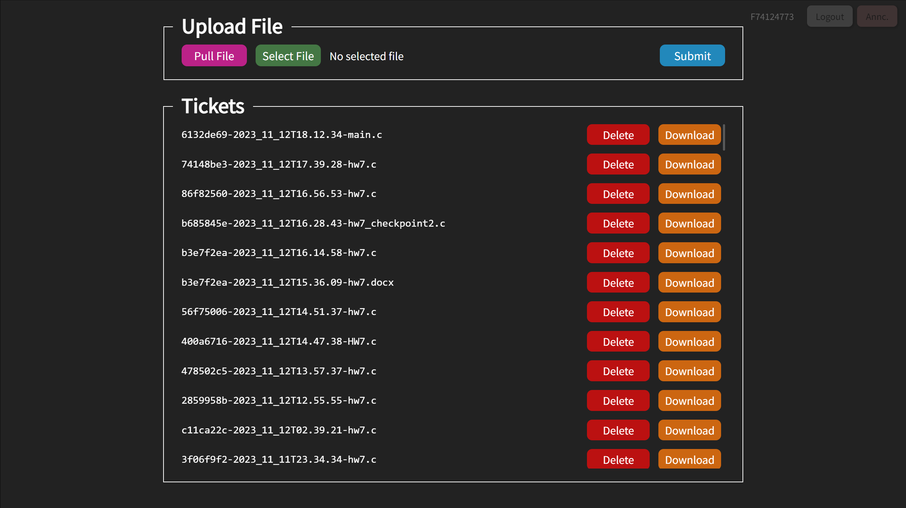
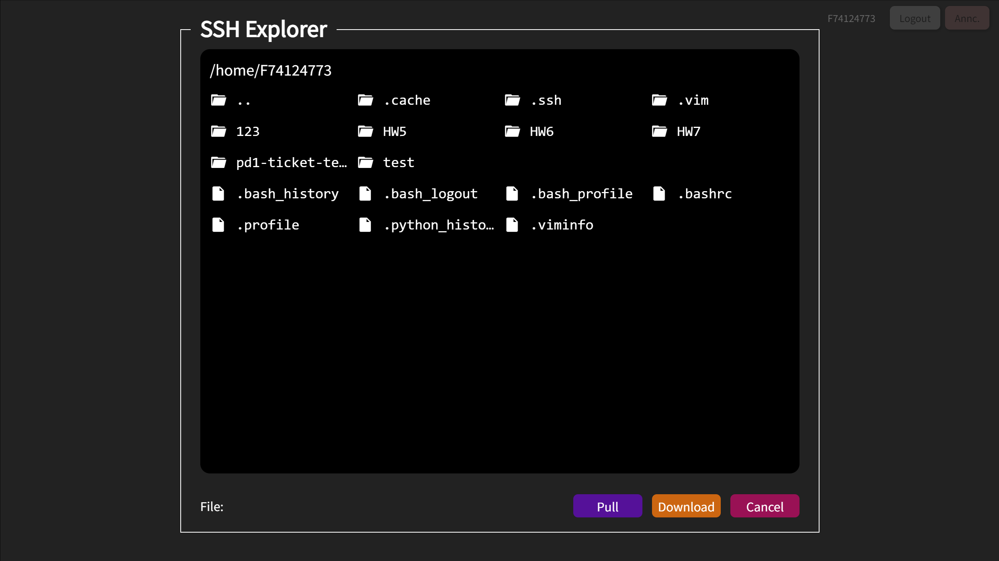
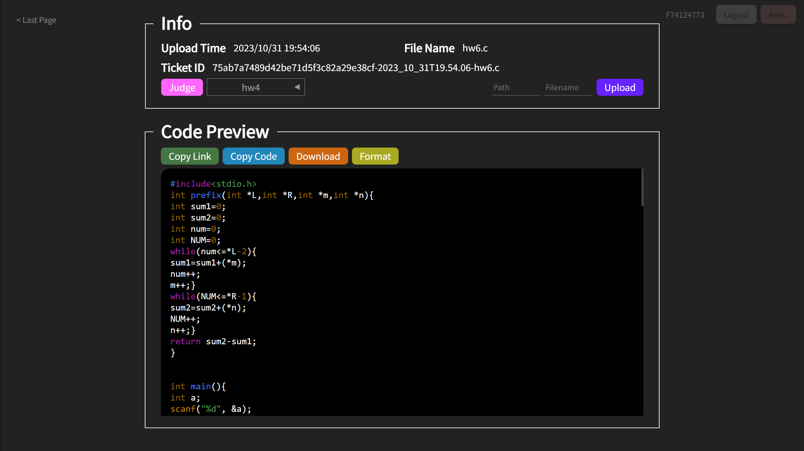
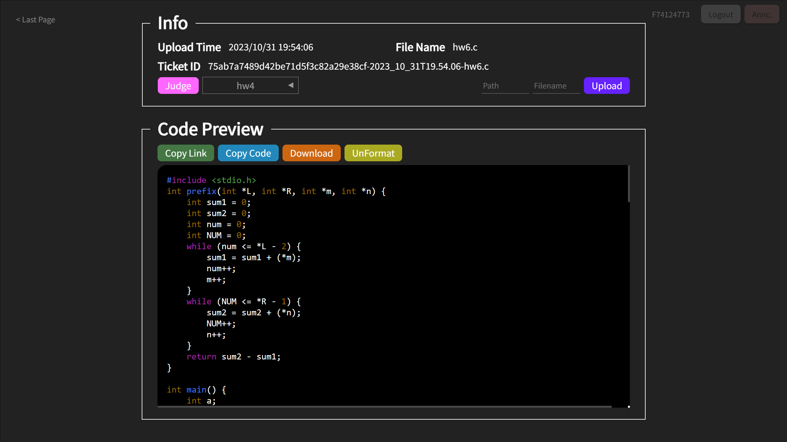
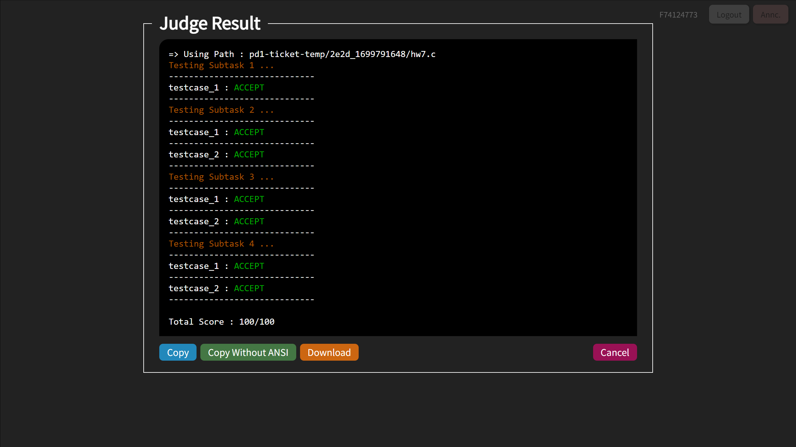

# PD1-Ticket
> 給程設一用的程式碼交換系統

## 壹、用途
提供 程式設計(一) 的學生與助教一個交換程式碼的地方，不必擔心自己的程式碼被其他同學抄走，又能夠發到公共頻道，同時讓多個助教看到，共同解答。

登入的時候以程設伺服器的SSH帳號/密碼登入，帳號與密碼皆存於Client Side LocalStorage中，密碼會經過加密。

## 貳、特色
 - ~~漂亮的UI~~
 - 可以上傳程式碼~~廢話~~
 - 提供GUI SSH Explorer，可以透過GUI介面從程設伺服器拉取檔案到此系統。
 - 承上點，除了將檔案拉到系統上以外，也可以下載到電腦上。
 - 運作無須DB，不必額外維護資料庫。
 - 提供一鍵上傳，可以在頁面中將程式碼上傳到程設伺服器，方便測試。
 - 提供一鍵測試，在頁面中就可以查看評分結果與輸出。
 - 提供Client Side Style Format，保護各位的眼睛~~還有肝~~。

#### 漂亮的GUI


#### 有GUI的SSH Explorer


#### Client Side Style Format <br/>
- Before Format

- After Format


#### 一鍵測試



## 參、安裝
### 後端
目錄位置: `backend`

#### 1.安裝依賴項目
```pip
pip install -r requirements.txt
```

#### 2.請確保環境中有`clang-format`
透過在終端機中輸入
```shell
clang-format -h
```
進行檢查

#### 3.第一次執行
```shell
python3 main.py
```
確保成功運行後請關閉程式。

#### 4.參數設定
`config.json`
```json
{
    "host": "0.0.0.0",        // Bind Address
    "port": 8080,             // Bind Port
    "api_root_path": "",      // API進入點，在Production中請設定為/api/v1
    "data_dir": "data",       // 儲存程式碼的資料夾位置
    "key": "<Key>",           // JWT中密碼加密金鑰，不建議變更
    "ssh_server": "",         // 程設伺服器SSH位置 address:port
    "admin_token": "<Token>", // JWT加密金鑰與管理員登入Token，透過登入時在密碼尾端加上此Token以管理員登入
    "admins": [],             // 管理員帳號白名單
    "judge_commands": [],     // 測試指令
    "expired_weekday": 3,     // Ticket過期日，以禮拜一為0
    "expired_week": 1,        // Ticket過期週數，1即代表Ticket在上傳後遇到第一個過期日，該Ticket即會過期(即所有人皆可存取)
}
```
`announcement.json`
```json
{
  "readonly": [
    "請不要嘗試攻擊網站。\nPlease do not try to attack the website.",
    "原則上不限制上傳檔案數，單個檔案上限32KB。\nThere is no limit with file num, but maximum 32 KB per file.",
    "上傳的檔案在下個禮拜四前皆只有你自己與助教可以存取，可以安心將連結傳至公共頻道。\nThe file you uploaded can only be access by you and TA before next thursday. Therefore, you can send the link to public channel safely.",
    "若有任何問題請在Discord私訊我: zhihao1021。\nIf there are any problems or bugs, DM me on discord: zhihao1021(nickname: YEE)."
  ],         // 請依情形自行修改以上內容
  "data": [] // 請將公告新增在這邊
}
```

#### 5.運行
```shell
python3 main.py
```

### 前端
目錄位置: `frontend`
#### 1.安裝依賴
```shell
npm install
```

#### 2.建置
```
npm run build
```
如果建置失敗的話，請前往修改以下位置:
```
node_modules/@wasm-fmt/clang-format/clang-format.js
```
將`r=await import("node:fs/promises")`取代為`r=require('fs').promises`

### Reverse Proxy
這裡使用的是`Nginx`，如果你用的是其他代理，請自行修改。

#### 1.修改設定
將`nginx.conf`中
```nginx
set $root /home/user/pd1-ticket;
```
修改為此資料夾的位置

#### 2.Include
在設定黨中`http`或`https`底下include此`nginx.conf`

## 肆、常見問題
### 無法複製
#### 問題
頁面中的`Copy Code`、`Copy Link`無法使用

#### 解決方法
剪貼簿API必須在https底下才能正常運行，請去簽一張憑證，或是透過CloudFlare的Proxy套上https
